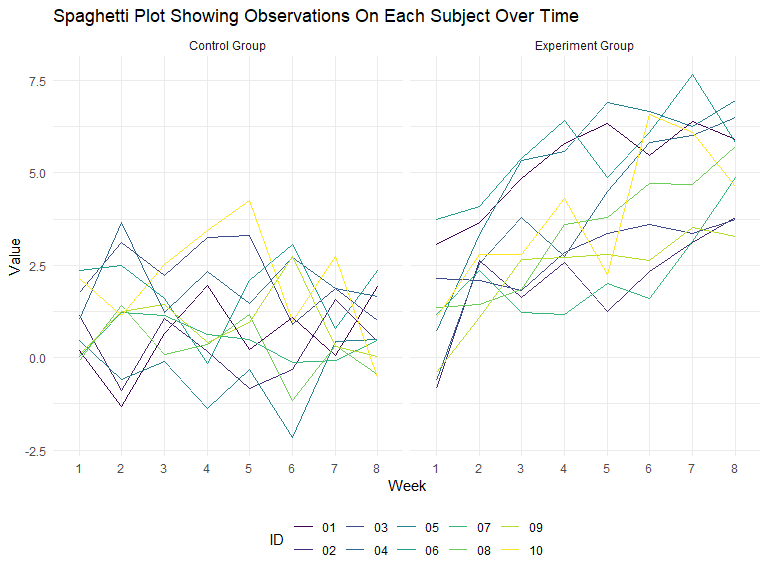

p8105\_hw5\_gx2144
================
Guangling Xu
2019/11/1

## Problem 1

``` r
library(tidyverse)
```

    ## -- Attaching packages ----------------------------------- tidyverse 1.2.1 --

    ## √ ggplot2 3.2.1     √ purrr   0.3.2
    ## √ tibble  2.1.3     √ dplyr   0.8.3
    ## √ tidyr   1.0.0     √ stringr 1.4.0
    ## √ readr   1.3.1     √ forcats 0.4.0

    ## -- Conflicts -------------------------------------- tidyverse_conflicts() --
    ## x dplyr::filter() masks stats::filter()
    ## x dplyr::lag()    masks stats::lag()

``` r
set.seed(10)

iris_with_missing = iris %>% 
  map_df(~replace(.x, sample(1:150, 20), NA)) %>%
  mutate(Species = as.character(Species))
```

## filling missing values

``` r
check = function(x) {
  
  if (is.numeric(x)) {
    x = replace_na(x, round(mean(x, na.rm = TRUE), digits = 2))
  } else if (is.character(x)) {
    x = replace_na(x, "virginica")
  }
  x 
}

output = map(iris_with_missing, check) %>% 
bind_cols()
```

## Problem 2

``` r
names = list.files(path = "./data/hw5_data/data")

read_data = function(x){
  path = str_c("./data/hw5_data/data/",x)
  read.csv(path)
}

mergedata = map(names, read_data) %>% 
  bind_rows() %>% 
  janitor::clean_names() %>% 
  mutate(
    file_names = names
  ) %>% 
  separate(file_names, into = c("Group", "ID"), sep = "_") %>% 
  mutate(
    ID = str_remove(ID, ".csv")
    ) %>% 
  select(Group, ID, everything())
```

    ## Warning in FUN(X[[i]], ...): strings not representable in native encoding
    ## will be translated to UTF-8

## Make a spaghetti plot

``` r
tidy_mergedata = 
  pivot_longer(
    mergedata, 
    week_1:week_8,
    names_to = "Week", 
    names_prefix = "week_",
    values_to = "Value") %>% 
  mutate(
    Group = recode(Group, con = "Control Group", exp = "Experiment Group")
  )
  
ggplot(tidy_mergedata,aes(x = Week,y = Value))+
    geom_line(aes(group = ID, color = ID)) + 
    theme_set(theme_minimal() + 
    theme(legend.position = "bottom"))+       
    facet_grid(.~Group)+
  labs(
    title = "Spaghetti Plot Showing Observations On Each Subject Over Time"
  )
```

<!-- -->
