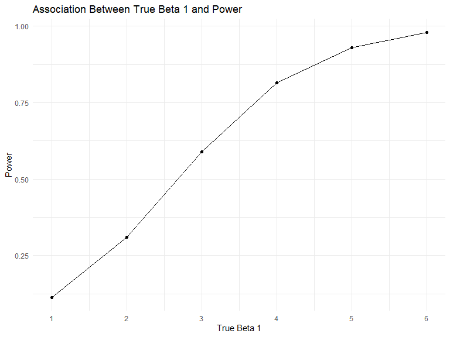

p8105\_hw5\_gx2144
================
Guangling Xu
2019/11/1

## Problem 1

``` r
library(tidyverse)
```

    ## -- Attaching packages -------------------------------- tidyverse 1.2.1 --

    ## √ ggplot2 3.2.1     √ purrr   0.3.2
    ## √ tibble  2.1.3     √ dplyr   0.8.3
    ## √ tidyr   1.0.0     √ stringr 1.4.0
    ## √ readr   1.3.1     √ forcats 0.4.0

    ## -- Conflicts ----------------------------------- tidyverse_conflicts() --
    ## x dplyr::filter() masks stats::filter()
    ## x dplyr::lag()    masks stats::lag()

``` r
knitr::opts_chunk$set(
    echo = TRUE,
    warning = FALSE,
    fig.width = 8, 
  fig.height = 6,
  out.width = "90%"
)
options(
  ggplot2.continuous.colour = "viridis",
  ggplot2.continuous.fill = "viridis"
)
scale_colour_discrete = scale_colour_viridis_d
scale_fill_discrete = scale_fill_viridis_d
theme_set(theme_minimal() + theme(legend.position = "bottom"))

set.seed(10)

iris_with_missing = iris %>% 
  map_df(~replace(.x, sample(1:150, 20), NA)) %>%
  mutate(Species = as.character(Species))
```

### Filling missing values

``` r
check = function(x) {
  
  if (is.numeric(x)) {
    x = replace_na(x, round(mean(x, na.rm = TRUE), digits = 2))
  } else if (is.character(x)) {
    x = replace_na(x, "virginica")
  }
  x 
}

map(iris_with_missing, check) %>% 
bind_cols() %>% 
knitr::kable(digits = 3)
```

| Sepal.Length | Sepal.Width | Petal.Length | Petal.Width | Species    |
| -----------: | ----------: | -----------: | ----------: | :--------- |
|         5.10 |        3.50 |         1.40 |        0.20 | setosa     |
|         4.90 |        3.00 |         1.40 |        0.20 | setosa     |
|         4.70 |        3.20 |         1.30 |        0.20 | setosa     |
|         4.60 |        3.10 |         1.50 |        1.19 | setosa     |
|         5.00 |        3.60 |         1.40 |        0.20 | setosa     |
|         5.40 |        3.90 |         1.70 |        0.40 | setosa     |
|         5.82 |        3.40 |         1.40 |        0.30 | setosa     |
|         5.00 |        3.40 |         1.50 |        0.20 | setosa     |
|         4.40 |        2.90 |         1.40 |        0.20 | setosa     |
|         4.90 |        3.10 |         3.77 |        0.10 | setosa     |
|         5.40 |        3.08 |         1.50 |        0.20 | setosa     |
|         4.80 |        3.40 |         1.60 |        0.20 | setosa     |
|         5.82 |        3.08 |         1.40 |        0.10 | setosa     |
|         4.30 |        3.00 |         3.77 |        0.10 | setosa     |
|         5.82 |        4.00 |         3.77 |        0.20 | setosa     |
|         5.70 |        4.40 |         1.50 |        0.40 | setosa     |
|         5.40 |        3.90 |         1.30 |        0.40 | setosa     |
|         5.10 |        3.50 |         1.40 |        1.19 | setosa     |
|         5.70 |        3.80 |         1.70 |        0.30 | setosa     |
|         5.10 |        3.80 |         1.50 |        1.19 | setosa     |
|         5.40 |        3.40 |         1.70 |        0.20 | setosa     |
|         5.10 |        3.70 |         1.50 |        0.40 | virginica  |
|         4.60 |        3.60 |         1.00 |        0.20 | setosa     |
|         5.82 |        3.30 |         3.77 |        0.50 | setosa     |
|         4.80 |        3.40 |         1.90 |        0.20 | virginica  |
|         5.00 |        3.00 |         3.77 |        0.20 | setosa     |
|         5.00 |        3.40 |         1.60 |        0.40 | virginica  |
|         5.20 |        3.50 |         1.50 |        0.20 | setosa     |
|         5.82 |        3.40 |         1.40 |        0.20 | setosa     |
|         4.70 |        3.20 |         1.60 |        0.20 | setosa     |
|         4.80 |        3.10 |         3.77 |        0.20 | setosa     |
|         5.40 |        3.08 |         1.50 |        0.40 | setosa     |
|         5.20 |        3.08 |         1.50 |        0.10 | setosa     |
|         5.50 |        4.20 |         1.40 |        0.20 | setosa     |
|         4.90 |        3.10 |         3.77 |        0.20 | setosa     |
|         5.00 |        3.20 |         1.20 |        0.20 | setosa     |
|         5.50 |        3.50 |         1.30 |        0.20 | setosa     |
|         4.90 |        3.60 |         1.40 |        0.10 | setosa     |
|         4.40 |        3.00 |         1.30 |        1.19 | setosa     |
|         5.10 |        3.40 |         1.50 |        0.20 | setosa     |
|         5.00 |        3.50 |         1.30 |        0.30 | setosa     |
|         4.50 |        3.08 |         1.30 |        1.19 | virginica  |
|         4.40 |        3.20 |         1.30 |        0.20 | setosa     |
|         5.00 |        3.50 |         1.60 |        0.60 | setosa     |
|         5.10 |        3.80 |         1.90 |        0.40 | setosa     |
|         4.80 |        3.00 |         1.40 |        0.30 | virginica  |
|         5.10 |        3.80 |         1.60 |        0.20 | setosa     |
|         4.60 |        3.20 |         3.77 |        0.20 | setosa     |
|         5.30 |        3.70 |         1.50 |        0.20 | setosa     |
|         5.00 |        3.08 |         1.40 |        0.20 | setosa     |
|         7.00 |        3.08 |         4.70 |        1.40 | virginica  |
|         6.40 |        3.20 |         4.50 |        1.50 | versicolor |
|         6.90 |        3.10 |         4.90 |        1.50 | versicolor |
|         5.50 |        2.30 |         4.00 |        1.30 | versicolor |
|         6.50 |        2.80 |         4.60 |        1.50 | versicolor |
|         5.70 |        2.80 |         4.50 |        1.30 | versicolor |
|         6.30 |        3.30 |         4.70 |        1.60 | virginica  |
|         4.90 |        2.40 |         3.77 |        1.00 | versicolor |
|         6.60 |        2.90 |         4.60 |        1.30 | virginica  |
|         5.20 |        2.70 |         3.90 |        1.40 | versicolor |
|         5.00 |        2.00 |         3.77 |        1.00 | versicolor |
|         5.90 |        3.00 |         4.20 |        1.50 | versicolor |
|         6.00 |        2.20 |         4.00 |        1.19 | versicolor |
|         6.10 |        2.90 |         4.70 |        1.40 | versicolor |
|         5.60 |        2.90 |         3.60 |        1.30 | versicolor |
|         6.70 |        3.10 |         4.40 |        1.40 | versicolor |
|         5.60 |        3.00 |         4.50 |        1.50 | versicolor |
|         5.80 |        3.08 |         4.10 |        1.00 | versicolor |
|         6.20 |        2.20 |         4.50 |        1.50 | versicolor |
|         5.60 |        2.50 |         3.90 |        1.10 | versicolor |
|         5.90 |        3.20 |         4.80 |        1.80 | versicolor |
|         5.82 |        2.80 |         4.00 |        1.30 | virginica  |
|         6.30 |        2.50 |         4.90 |        1.50 | versicolor |
|         5.82 |        2.80 |         3.77 |        1.20 | versicolor |
|         6.40 |        2.90 |         4.30 |        1.30 | versicolor |
|         6.60 |        3.00 |         4.40 |        1.40 | versicolor |
|         6.80 |        2.80 |         4.80 |        1.40 | versicolor |
|         6.70 |        3.08 |         5.00 |        1.19 | versicolor |
|         6.00 |        3.08 |         4.50 |        1.19 | versicolor |
|         5.70 |        2.60 |         3.50 |        1.00 | virginica  |
|         5.50 |        2.40 |         3.80 |        1.10 | versicolor |
|         5.82 |        2.40 |         3.70 |        1.00 | versicolor |
|         5.80 |        2.70 |         3.90 |        1.20 | versicolor |
|         6.00 |        2.70 |         5.10 |        1.60 | versicolor |
|         5.40 |        3.00 |         4.50 |        1.50 | versicolor |
|         5.82 |        3.40 |         4.50 |        1.60 | versicolor |
|         6.70 |        3.10 |         4.70 |        1.19 | versicolor |
|         5.82 |        3.08 |         4.40 |        1.30 | versicolor |
|         5.60 |        3.00 |         3.77 |        1.19 | versicolor |
|         5.50 |        2.50 |         4.00 |        1.19 | versicolor |
|         5.50 |        3.08 |         4.40 |        1.20 | versicolor |
|         5.82 |        3.08 |         4.60 |        1.19 | versicolor |
|         5.80 |        3.08 |         4.00 |        1.19 | versicolor |
|         5.00 |        2.30 |         3.30 |        1.19 | virginica  |
|         5.82 |        2.70 |         4.20 |        1.30 | versicolor |
|         5.70 |        3.00 |         4.20 |        1.20 | versicolor |
|         5.70 |        2.90 |         4.20 |        1.30 | versicolor |
|         6.20 |        2.90 |         4.30 |        1.30 | versicolor |
|         5.10 |        2.50 |         3.00 |        1.19 | versicolor |
|         5.70 |        2.80 |         4.10 |        1.30 | virginica  |
|         6.30 |        3.08 |         3.77 |        2.50 | virginica  |
|         5.80 |        2.70 |         5.10 |        1.90 | virginica  |
|         7.10 |        3.00 |         5.90 |        2.10 | virginica  |
|         6.30 |        2.90 |         5.60 |        1.80 | virginica  |
|         6.50 |        3.08 |         5.80 |        2.20 | virginica  |
|         7.60 |        3.00 |         6.60 |        2.10 | virginica  |
|         4.90 |        2.50 |         4.50 |        1.70 | virginica  |
|         7.30 |        2.90 |         6.30 |        1.80 | virginica  |
|         6.70 |        3.08 |         3.77 |        1.80 | virginica  |
|         5.82 |        3.60 |         3.77 |        2.50 | virginica  |
|         6.50 |        3.20 |         5.10 |        2.00 | virginica  |
|         5.82 |        2.70 |         5.30 |        1.90 | virginica  |
|         6.80 |        3.00 |         5.50 |        2.10 | virginica  |
|         5.70 |        3.08 |         5.00 |        2.00 | virginica  |
|         5.80 |        2.80 |         5.10 |        2.40 | virginica  |
|         6.40 |        3.20 |         5.30 |        2.30 | virginica  |
|         6.50 |        3.00 |         3.77 |        1.80 | virginica  |
|         7.70 |        3.80 |         6.70 |        1.19 | virginica  |
|         7.70 |        2.60 |         6.90 |        2.30 | virginica  |
|         6.00 |        2.20 |         5.00 |        1.50 | virginica  |
|         5.82 |        3.20 |         5.70 |        1.19 | virginica  |
|         5.60 |        3.08 |         4.90 |        2.00 | virginica  |
|         7.70 |        2.80 |         6.70 |        2.00 | virginica  |
|         6.30 |        2.70 |         4.90 |        1.80 | virginica  |
|         6.70 |        3.30 |         5.70 |        2.10 | virginica  |
|         7.20 |        3.20 |         6.00 |        1.80 | virginica  |
|         6.20 |        2.80 |         4.80 |        1.80 | virginica  |
|         6.10 |        3.00 |         4.90 |        1.80 | virginica  |
|         6.40 |        2.80 |         5.60 |        2.10 | virginica  |
|         7.20 |        3.00 |         5.80 |        1.60 | virginica  |
|         7.40 |        2.80 |         6.10 |        1.19 | virginica  |
|         7.90 |        3.80 |         3.77 |        2.00 | virginica  |
|         6.40 |        2.80 |         3.77 |        2.20 | virginica  |
|         5.82 |        2.80 |         5.10 |        1.50 | virginica  |
|         6.10 |        3.08 |         5.60 |        1.40 | virginica  |
|         5.82 |        3.00 |         6.10 |        2.30 | virginica  |
|         5.82 |        3.40 |         5.60 |        1.19 | virginica  |
|         6.40 |        3.10 |         5.50 |        1.19 | virginica  |
|         6.00 |        3.00 |         4.80 |        1.80 | virginica  |
|         6.90 |        3.10 |         5.40 |        2.10 | virginica  |
|         6.70 |        3.10 |         5.60 |        2.40 | virginica  |
|         6.90 |        3.10 |         5.10 |        2.30 | virginica  |
|         5.82 |        2.70 |         5.10 |        1.90 | virginica  |
|         6.80 |        3.20 |         3.77 |        2.30 | virginica  |
|         6.70 |        3.30 |         3.77 |        2.50 | virginica  |
|         6.70 |        3.00 |         5.20 |        2.30 | virginica  |
|         6.30 |        2.50 |         5.00 |        1.90 | virginica  |
|         6.50 |        3.00 |         5.20 |        2.00 | virginica  |
|         5.82 |        3.40 |         5.40 |        2.30 | virginica  |
|         5.90 |        3.00 |         5.10 |        1.80 | virginica  |

## Problem 2

``` r
names = list.files(path = "./data/hw5_data/data")

read_data = function(x){
  path = str_c("./data/hw5_data/data/",x)
  read.csv(path)
}

mergedata = map(names, read_data) %>% 
  bind_rows() %>% 
  janitor::clean_names() %>% 
  mutate(
    file_names = names
  ) %>% 
  separate(file_names, into = c("Group", "ID"), sep = "_") %>% 
  mutate(
    ID = str_remove(ID, ".csv")
    ) %>% 
  select(Group, ID, everything()) 
 
knitr::kable(mergedata, digits = 3)
```

| Group | ID | week\_1 | week\_2 | week\_3 | week\_4 | week\_5 | week\_6 | week\_7 | week\_8 |
| :---- | :- | ------: | ------: | ------: | ------: | ------: | ------: | ------: | ------: |
| con   | 01 |    0.20 |  \-1.31 |    0.66 |    1.96 |    0.23 |    1.09 |    0.05 |    1.94 |
| con   | 02 |    1.13 |  \-0.88 |    1.07 |    0.17 |  \-0.83 |  \-0.31 |    1.58 |    0.44 |
| con   | 03 |    1.77 |    3.11 |    2.22 |    3.26 |    3.31 |    0.89 |    1.88 |    1.01 |
| con   | 04 |    1.04 |    3.66 |    1.22 |    2.33 |    1.47 |    2.70 |    1.87 |    1.66 |
| con   | 05 |    0.47 |  \-0.58 |  \-0.09 |  \-1.37 |  \-0.32 |  \-2.17 |    0.45 |    0.48 |
| con   | 06 |    2.37 |    2.50 |    1.59 |  \-0.16 |    2.08 |    3.07 |    0.78 |    2.35 |
| con   | 07 |    0.03 |    1.21 |    1.13 |    0.64 |    0.49 |  \-0.12 |  \-0.07 |    0.46 |
| con   | 08 |  \-0.08 |    1.42 |    0.09 |    0.36 |    1.18 |  \-1.16 |    0.33 |  \-0.44 |
| con   | 09 |    0.08 |    1.24 |    1.44 |    0.41 |    0.95 |    2.75 |    0.30 |    0.03 |
| con   | 10 |    2.14 |    1.15 |    2.52 |    3.44 |    4.26 |    0.97 |    2.73 |  \-0.53 |
| exp   | 01 |    3.05 |    3.67 |    4.84 |    5.80 |    6.33 |    5.46 |    6.38 |    5.91 |
| exp   | 02 |  \-0.84 |    2.63 |    1.64 |    2.58 |    1.24 |    2.32 |    3.11 |    3.78 |
| exp   | 03 |    2.15 |    2.08 |    1.82 |    2.84 |    3.36 |    3.61 |    3.37 |    3.74 |
| exp   | 04 |  \-0.62 |    2.54 |    3.78 |    2.73 |    4.49 |    5.82 |    6.00 |    6.49 |
| exp   | 05 |    0.70 |    3.33 |    5.34 |    5.57 |    6.90 |    6.66 |    6.24 |    6.95 |
| exp   | 06 |    3.73 |    4.08 |    5.40 |    6.41 |    4.87 |    6.09 |    7.66 |    5.83 |
| exp   | 07 |    1.18 |    2.35 |    1.23 |    1.17 |    2.02 |    1.61 |    3.13 |    4.88 |
| exp   | 08 |    1.37 |    1.43 |    1.84 |    3.60 |    3.80 |    4.72 |    4.68 |    5.70 |
| exp   | 09 |  \-0.40 |    1.08 |    2.66 |    2.70 |    2.80 |    2.64 |    3.51 |    3.27 |
| exp   | 10 |    1.09 |    2.80 |    2.80 |    4.30 |    2.25 |    6.57 |    6.09 |    4.64 |

### Make a spaghetti plot

``` r
tidy_mergedata = 
  pivot_longer(
    mergedata, 
    week_1:week_8,
    names_to = "Week", 
    names_prefix = "week_",
    values_to = "Value") %>% 
  mutate(
    Group = recode(Group, con = "Control Group", exp = "Experiment Group")
  )
  
ggplot(tidy_mergedata,aes(x = Week,y = Value))+
    geom_line(aes(group = ID, color = ID)) + 
    theme_set(theme_minimal() + 
    theme(legend.position = "bottom"))+       
    facet_grid(.~Group)+
  labs(
    title = "Spaghetti Plot Showing Observations On Each Subject Over Time"
  )
```


  - Comment:

The experiment group has higher observation value than the control group
on average. Overall, values in experiment group got higher as week went
by while values in control group got lower while week went by.

## Problem 3

### Regression when Beta Equals 0

``` r
sim_regression = function(beta1) {
  
  sim_data = tibble(
    x = rnorm(30, mean = 0, sd = 1),
    y = 2 + beta1 * x + rnorm(30, 0, sqrt(50))
  )
  
  ls_fit = lm(y ~ x, data = sim_data) %>% 
  broom::tidy()
  
  tibble(
    beta1_hat = pull(ls_fit,estimate)[2],
    p_value = pull(ls_fit,p.value)[2]
  )
}

sim_results = 
  rerun(10000, sim_regression(0)) %>% 
  bind_rows()
```

### Regression when Beta Equals 1-6

``` r
simulate_n_regressions = 
  function(n_runs = 10000,beta1) 
  {rerun(n_runs, sim_regression(beta1)) %>% 
    bind_rows()
  }


sim_results2 = 
  tibble(beta1 = c(1, 2, 3, 4, 5, 6)) %>% 
  mutate(
    estimate_dfs = map(.x = beta1, ~simulate_n_regressions(n_runs = 10000, beta1 = .x))
  ) %>% 
  unnest %>% 
  unnest
```

### Make a Plot reporting the proportion of times the null was rejected

``` r
plot1 = sim_results2 %>% 
  filter(p_value < 0.05) %>% 
  group_by(beta1) %>% 
  summarise(
    power = n()/10000
  ) 

ggplot(plot1, aes(x = beta1,y = power))+
  geom_point()+
  geom_line()+
  labs(
    title = "Association Between True Beta 1 and Power",
    x = "True Beta 1",
    y = "Power"
  )+
  scale_x_continuous(
    breaks = c(0,1,2,3,4,5,6), 
    labels = c(0,1,2,3,4,5,6)) 
```



  - Comment:

From the plot we can see that Power increases as True β1 increases.There
is a positive relationship between True β1 and Power. Since H: β1 = 0
and Power = Φ (Z+ (μ0-μ1)/σ \* √n),we can see that as effect size μ0-μ1
increases, power increases.

### Plot of Average of Estimated Beta and True value of Beta

``` r
plot2 = sim_results2 %>%
  group_by(beta1) %>% 
  summarize(
    mean1 = mean(beta1_hat)
  )

plot3 = sim_results2 %>% 
  filter(p_value < 0.05) %>% 
  group_by(beta1) %>% 
  summarize(
    mean2 = mean(beta1_hat)
  )

binddata = left_join(plot2, plot3)
```

    ## Joining, by = "beta1"

``` r
ggplot(binddata, aes(x = beta1))+
  geom_point(aes(y = mean1))+
  geom_line(aes(y = mean1, color = "red"))+
  geom_point(aes(y = mean2))+
  geom_line(aes(y = mean2,color = "blue"))+
  scale_colour_discrete(labels = c('Average Estimate When Null was rejected','Average Estimate '))+
  labs(
    title = "Association Between Average Estimate Beta 1 and True Beta 1",
    x = "True Beta 1",
    y = "Average Estimate Beta 1"
  )+
  scale_x_continuous(
    breaks = c(0,1,2,3,4,5,6), 
    labels = c(0,1,2,3,4,5,6)) 
```


  - Comment：

According to graph above, the slope of the yellow line which denotes the
relationship between the true β1 and average estimate β1 with compeleted
data equals to 1. The sample average of estimated β1 across tests for
which the null is rejected does not equal to the true value of β1 when
β1 is 1, 2 and 3 but close to value of true β1 when β1 is small(β1 = 0)
or β1 is big(β1 = 4, 5 and 6).The reason behind this is that when true
β1 is small, power is small, which means that proportion of times the
null was rejected is small. So average of estimated β1 across tests for
which the null is rejected filtered β1 = 0 so that it is larger than the
average estimate β1 with compeleted data. However, when β1 gets bigger,
effect size gets bigger, power gets bigger, proportion of times the null
was rejected gets bigger. This leads to the fact that the proportion of
β1 = 0 gets smaller so that average of estimated β1 across tests for
which the null is rejected gets closer to average estimate β1 with
compeleted data when true β1 gets bigger.
